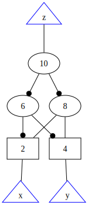
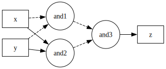

# aigtodot-fine


Process and refine the output generated by [aigtodot](https://github.com/arminbiere/aiger).


## Example 

Before: 



After:



## Usage

```
usage: python aigtodot-fine.py [-h] -i INPUT -o OUTPUT

Process and refine the output generated by aigtodot.

options:
  -h, --help            show this help message and exit
  -i INPUT, --input INPUT
                        Path to the input DOT file.
  -o OUTPUT, --output OUTPUT
                        Path to the output DOT file.
```

